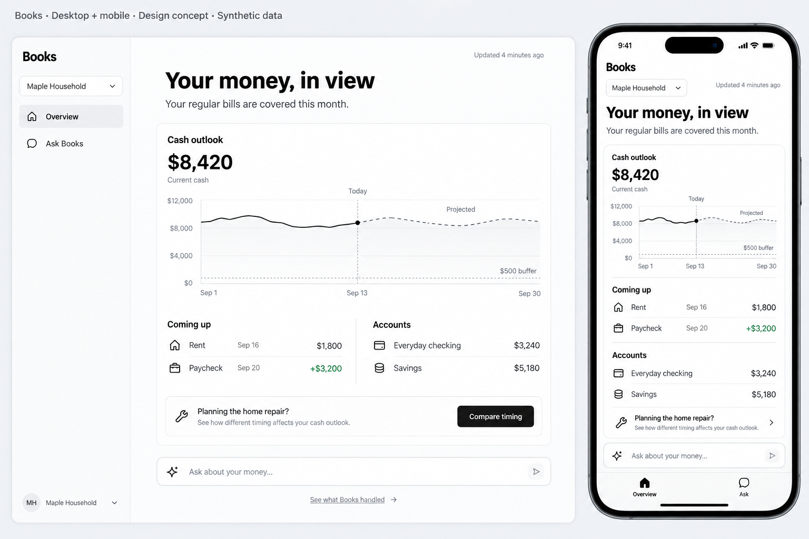
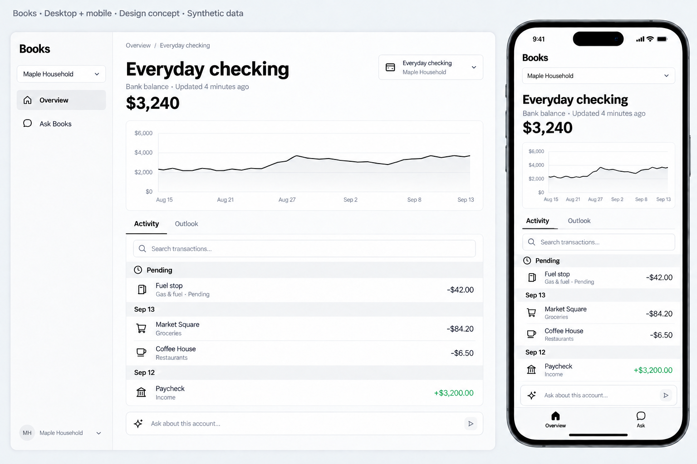
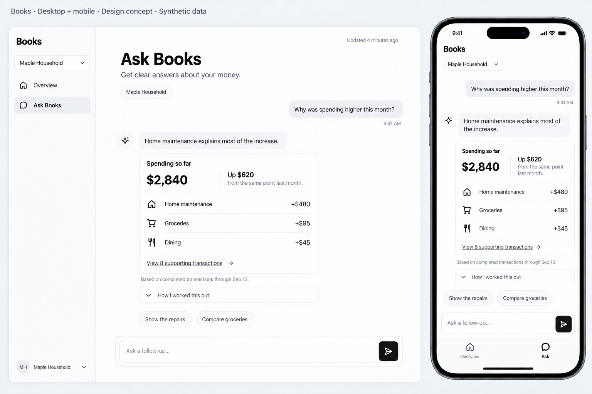
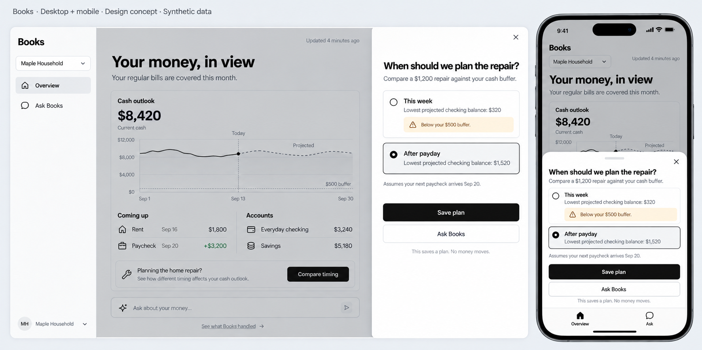

# Books: AI-operated interface

Three core experiences, with two navigation destinations: **Overview** and
**Ask Books**. Open an account from the overview. Decisions appear where they
arise, in a desktop Sheet or mobile Drawer.

AI handles importing, classification, posting, reconciliation, and routine
maintenance. The interface helps people understand their finances, inspect
evidence, set intent, and resolve meaningful choices.

These are imagegen design concepts, not an implemented frontend. All names
and amounts are synthetic. This direction supersedes the navigation in the
[v1 operation atlas](../screens-v1/README.md); that atlas remains API coverage
reference material.

## Desktop and mobile designs

### 1. Overview

One financial brief, cash outlook, upcoming obligations, and account links.
Work performed by Books is available through a collapsed disclosure.
Only show a decision when a real user preference is needed.

### 2. Account detail

Historical balance and searchable activity, with pending activity separated.
Ask a question with the account already in context. The Outlook tab switches
to an explicitly projected view.

### 3. Ask Books

Answers include compact financial visuals, linked supporting transactions,
scope, and data freshness. “How I worked this out” exposes sources,
calculations, assumptions, and action history.

### 4. Contextual decision state

A timing choice opens over the current screen. Show options, consequences,
and assumptions together. Saving a plan does not execute a bank transfer.

## Personal and business

The entity selector changes the entire financial context, including the
conversation and account links. Personal and business use the same routes.
Never silently combine entities or currencies.

| Context | Overview brief | Coming up | Typical question |
| --- | --- | --- | --- |
| Personal | Cash, spending, income, household goals | Bills and expected income | Why did spending rise? |
| Business | Cash, revenue, expenses, profit | Known obligations and expected receipts | What changed our margin? |

Business performance appears as a concise inline summary in the same overview,
with evidence drilldown. It does not require a separate navigation tree.

## shadcn implementation map

Use the existing [shadcn component catalog](https://ui.shadcn.com/docs/components)
and compose the product-specific content around these primitives.

| Area | Components |
| --- | --- |
| Desktop shell and entity scope | Sidebar, Dropdown Menu, Button |
| Mobile shell | Button links in a semantic bottom navigation; Dropdown Menu |
| Overview | Card, Chart, Item, Separator, Collapsible |
| Account | Breadcrumb, Tabs, Input, Table on desktop; Item rows on mobile |
| Conversation | Card, Badge, Collapsible, Input Group, Textarea, Button |
| Decision | Sheet on desktop, Drawer on mobile, Radio Group, Alert, Button |
| Loading and missing data | Skeleton, Empty, Alert |

The [Sheet](https://ui.shadcn.com/docs/components/base/sheet) complements the
current screen. Preserve that relationship when adapting it to a mobile Drawer.
Use neutral zinc tokens, thin borders, restrained icons, approximately 8px
corner radii, and black primary buttons. Keep status color semantic.

Responsive implementation: sidebar at desktop sizes; two-item bottom
navigation on mobile; one-column content; no horizontally scrolling transaction
table on phones. Make mobile touch targets at least 44px. Preserve keyboard
focus, label icon controls, and restore focus when a Sheet or Drawer closes.
The modal overlay must cover and disable background navigation, including the
mobile bottom bar; the image's visible bottom bar is background context.

## Data and behavior contract

- Distinguish bank balances, posted ledger balances, pending activity, and
  projections. Each answer and chart identifies its basis and freshness.
- Forecasts use a visible actual/projected boundary and disclose assumptions.
  Account chart curves in these raster concepts are illustrative; implementation
  must calculate exact plotted points from the stated balance series.
- A cash buffer belongs to a stated account or cash scope. The household cash
  chart and the checking-account repair comparison have distinct scopes.
- If data is stale, incomplete, or unavailable, say so in place of a reassuring
  claim. Reuse these layouts for loading, empty, and error states.
- Agent work stays inspectable through a concise activity disclosure. Ask the
  user only when missing intent or a material choice blocks progress.
- Saving a planning preference and executing a financial action are separate
  capabilities. Any later execution flow must state its actual effect.

Books currently supplies ledger operations through CLI, HTTP, and MCP.
These designs propose the frontend and AI orchestration experience. Forecasts,
obligations, and saved scenario plans need additional implementation; the images
do not establish that those capabilities exist.

## Generation and review

Generated with the built-in imagegen tool. The overview was the style reference
for the other three boards. Account history dates were refined after visual
review. Final PNGs were inspected for layout, text, scope, and mobile hierarchy.
Raster designs approximate components; they are not rendered React components.

Prompts:

- [Overview](prompts/01-overview.txt)
- [Account](prompts/02-account.txt), [account refinement](prompts/02-account-refinement.txt)
- [Ask Books](prompts/03-ask-books.txt)
- [Decision](prompts/04-decision.txt)
