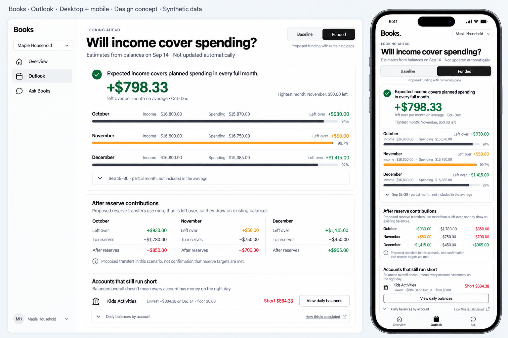
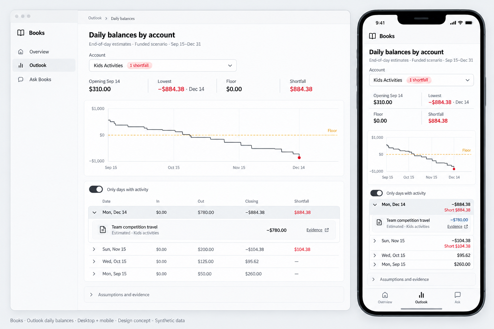

# Outlook: will income cover spending?

A connected entity with a saved cash plan gets an **Outlook** destination beside
Overview and Ask Books. It answers one question before showing detail:
does expected income cover planned spending, month by month, from here forward?

The screen is point-forward only. Posted history, the ledger period picker and
profit and loss stay on Overview. The Overview shows a compact *Looking ahead*
card that links here; it never blends forecast figures into recorded totals.

## What a person should understand

In order of the page:

1. **The answer.** One sentence, the average left over (or short) per full
   month, the tightest month, and each full month's income, spending and left
   over with a bar showing spending as a share of income.
2. **Reserves.** How reserve transfers in the selected scenario change what's
   left, per month, per reserve account. The page says plainly that these are
   the scenario's transfers, not proof that reserve targets are met.
3. **Account gaps.** Accounts that fall below their floor, from which date, for
   how many days and how far. A balanced household can still run one account
   short on the wrong day.
4. **Daily balances.** The existing per-account daily drilldown: chart, floor,
   lowest point, days, movements and evidence.
5. **How this is calculated.** Definitions, plan coverage, event statuses,
   assumptions and the plan digest.

Freshness is always visible: "Estimates from balances on Sep 14 (yesterday) ·
Not updated automatically". Months that have already ended are marked
**Past · estimate** so an old plan can't pass for actuals.

## Semantics

Implemented once in [`web/src/lib/forecast.ts`](../../../web/src/lib/forecast.ts)
with integer minor units. Unit tests cover each rule; the web integration test
runs the real Books engine on the synthetic household and checks the figures
and the balance identities below.

| Term | Definition |
| --- | --- |
| Horizon | Events dated after `as_of` through `through`, excluding expectations replaced by an actual. |
| Income | Every `inflow`. |
| Spending | Every `outflow`, from bank accounts **and cards**. Card purchases count once; bank-to-card payments and all transfers are never spending. |
| To reserves | Change in reserved bank accounts: transfers in, less transfers out and spending paid from a reserve. |
| After reserves | Left over less to reserves. Equals the change in non-reserve bank and card money for the month. |
| Month | Calendar month of the event date (transfers use departure). A month is **full** only if the plan covers its first and last day. |
| Averages | Full months only, rounded half away from zero to a minor unit. Partial months are shown collapsed and labelled as excluded. |
| Account gap | A bank account with shortfall on any day from the opening snapshot: first date, days short, lowest balance and shortfall at the lowest point. |

Accounts left out of a plan (for example excluded owners, trusts or
investments) are not operating cash here. Nothing on this screen edits plans,
posts entries or moves money.

A scenario with no proposed events and account gaps shows a **Compare** prompt
toward the other scenarios, since a baseline without funding transfers usually
leaves funded accounts empty.

## Component map

| Area | Components |
| --- | --- |
| Navigation | Existing sidebar `Button` and mobile bottom bar, driven by one page list; Outlook appears only when `/api/config` lists scenarios for the entity |
| Scenario | shadcn `ToggleGroup` (single, outline) |
| Answer, reserves, gaps, summary | `Card`, `Badge`, `Button`, `Collapsible`, `Skeleton` |
| Money | `Amount` ([amount.tsx](../../../web/src/components/amount.tsx)): exact formatting, tabular figures, color only for meaning |
| Month row | `MonthRow` in [outlook.tsx](../../../web/src/components/outlook.tsx), reused for partial months |
| Daily balances | [daily-balances.tsx](../../../web/src/components/daily-balances.tsx): shadcn `Select`, `ToggleGroup` day filter, `Table`, Recharts through `ChartContainer` |
| Data | `useForecast` loads one scenario, caches results, keeps the last good result while switching |

`select`, `table`, `toggle` and `toggle-group` were added with shadcn CLI 4.21.0
(Radix Nova, neutral), matching the existing components.

## Tokens and patterns

- `--positive` / `text-positive`: money left over. `--floor` / `border-floor`:
  the dashed floor line. `text-destructive`: shortfalls and months that are short.
  Light and dark values live in `web/src/index.css`.
- `.stat-label` for small muted labels; `.amount` for tabular, unbroken money.
- The hero number stays foreground colored, like the Overview's cash figure.
  Status color is on the icon and the per-month values.
- Layouts inside cards use **container queries** (`@container`, `@xl:`, `@2xl:`,
  `@3xl:`) because card width depends on the sidebar, not the viewport.
- The *Tightest* badge marks the smallest full month without inventing a
  warning threshold.
- 44px touch targets for scenario, gap, day and disclosure controls.

## States

Loading skeletons; scenario load failure with **Try again** and **Back to** the
first scenario; switching scenarios keeps the prior result dimmed; no full month
yet; a short month; average short; no reserve activity; no gaps; many gaps;
days filtered to *Below floor*, *With activity* or *All days* with a disabled
empty filter; long lists paged at 31 days; entities without a plan show no
Outlook and Overview says no plan is connected. Account detail's Outlook tab
links to that account's daily balances when the plan includes it.

## Design concepts

Generated with imagegen (through Codex) from the approved
[v2 overview](../ai-first-v2/01-overview.png) as the style reference. Names and
amounts are synthetic; they predate final tuning of the synthetic fixture, so
some figures differ from the implementation.

Prompts: [Outlook](prompts/01-outlook.txt), [daily balances](prompts/02-daily-balances.txt).

Deliberate differences from the concepts: the hero number is not green; the
amber "thin month" treatment and percentage labels were replaced by a neutral
*Tightest* badge and the bar; daily balances stay open with a day filter; gap
rows also state the first date and days short; and month rows expand to
spending by category.

## Coverage record

Checked in Chromium on the synthetic household (`npm run preview:forecast`,
real Books engine and web facade).

| Journey or state | Evidence |
| --- | --- |
| Overview summary → Outlook | Playwright desktop and mobile; screenshots at 1440 and 390 |
| Answer, tightest, partial month, category expansion | Playwright; real-engine integration figures |
| Scenario switch, reserves per month and account | Playwright; integration identities per month and scenario |
| Gap → daily balances, focus, filter, evidence | Playwright; keyboard focus lands on the section heading |
| Account change resets filter; empty filter disabled | Playwright |
| Leave and return keeps scenario and account | Playwright |
| Scenario failure, retry, back to first scenario | Playwright |
| Account detail → Outlook for that account | Playwright |
| Demo mode has no Outlook | Playwright |
| No page overflow or clipped text, 320–2560 px in 16/80 px steps, while resizing | Scripted sweep on Outlook (both scenarios, expanded, all days), Overview and account detail |
| Real household plan figures | A private plan was evaluated with this module outside the repository; results are not committed |

Not checked: dark theme (the app has no theme switch yet), screen readers
beyond Chromium's accessibility tree, Safari/WebKit, and live refresh behavior,
which does not exist.
