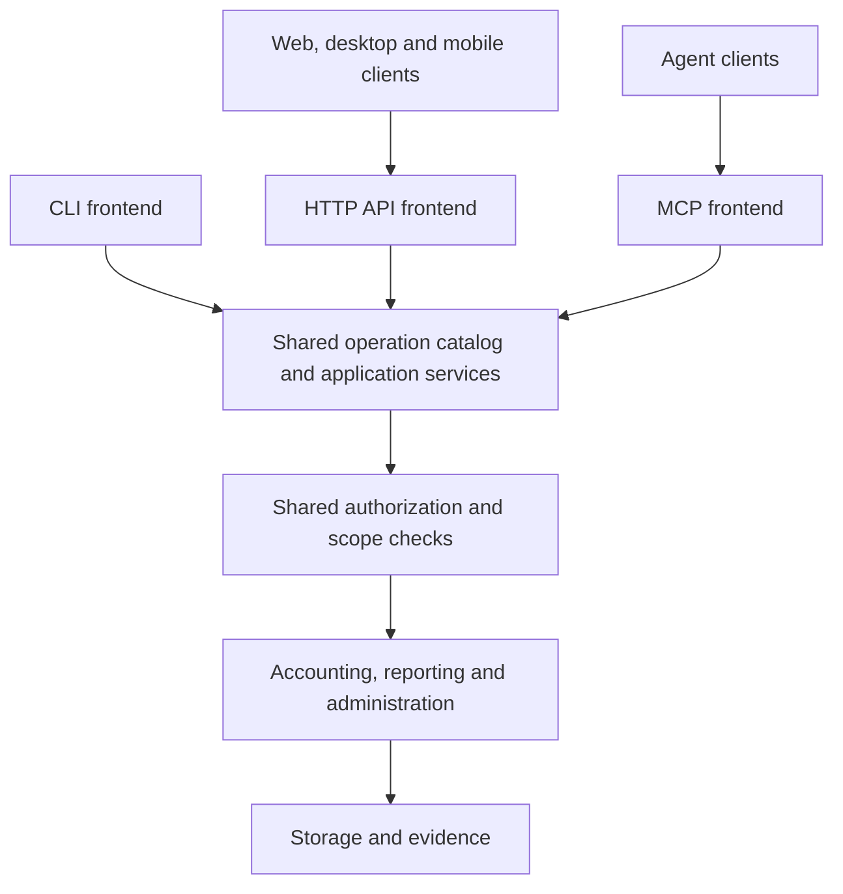

# Complete backend and interface parity

Approved design direction, September 13, 2026. This refines the September 12
headless-backend and thin-CLI direction. It specifies the target architecture;
it does not claim that the missing API operations or MCP server are implemented.

Implementation status and remaining work are tracked in
[implementation progress](implementation/parity-progress.md).

## One backend, three frontends

Every supported Books accounting and administrative operation belongs to the
backend and must be available through the CLI, HTTP API and MCP. A web, mobile
or desktop client must be able to operate Books without shelling out to its CLI,
reading its SQLite schema, or reimplementing a workflow. An MCP agent has the
same completeness requirement.

The CLI parses flags and input files, selects local connection context, formats
results and chooses exit codes. It calls shared application services directly
for local use. HTTP and MCP adapters authenticate/identify callers, decode typed
requests and encode protocol responses. Shared backend authorization validates
operation scope and grants, followed by application orchestration and accounting
rules. Presentation and transport differences do not create separate business
implementations.

Local CLI and stdio MCP operation need no listener. The HTTP API is explicitly
started and remains loopback in the documented default setup. Full capability
coverage does not imply public network exposure or unrestricted credentials.

## Backend-owned operation catalog

Use one canonical operation descriptor with:

- Stable operation ID, version, typed input and output, field constraints and
  exact-money representation in the domain.
- Company/database/registry scope, grants and cross-company requirements.
- Validation, side effects, draft/preview/apply modes, transaction boundary,
  idempotency, recovery and evidence requirements.
- CLI command/alias mapping, HTTP method/path and OpenAPI operation ID, and MCP
  tool name/schema.
- Positive, negative and cross-interface conformance fixtures.

Move workflow logic remaining in CLI handlers into application services. Keep
ledger invariants in ledger/storage services. The HTTP router and MCP tool handler
must not decide accounting policy, generate different plans, or access storage
through bypass paths. Local actor authority may be broad, but it enters through
an explicit trusted-local context rather than skipping backend validation.

Do not generate application semantics from Cobra commands or infer authorization
from route names. Derive adapter schemas and coverage checks from typed backend
descriptors, with explicit transport conversions where necessary. Existing HTTP
minor-unit strings and CLI decimal strings must remain compatible and convert
losslessly to the same domain values. MCP decimal strings do not require a
breaking rewrite of the current HTTP contract.

## Required API expansion

The [coverage inventory](mcp-coverage.md) is the starting checklist. All its
business and administrative operations require HTTP and MCP bindings. Existing
HTTP endpoints stay supported; add versioned OpenAPI coverage for missing routes.
Proposed route families below are design namespaces, not shipped endpoints.

| Capability | HTTP scope and proposed route family | Required boundary |
| --- | --- | --- |
| Company creation and registry configuration | `/v1/admin/registry/companies`, `/v1/admin/registry/settings` | Registry administration, configured storage destinations |
| Database initialization, schema status/migration, Doctor and audit | `/v1/admin/databases/{database}/…` | Explicit database administration; preview/apply for migration |
| Backup, restore, export and recovery status | `/v1/admin/databases/{database}/backups`, `/restore-plans`, `/operations` | Whole-database authority, lineage and maintenance locking |
| Entities, books, ownership and consolidation groups | `/v1/databases/{database}/entities`, `/books`, `/ownership`, `/groups` | Authorized database topology management |
| Consolidated and detailed general-ledger reports | `/v1/databases/{database}/reports/…`, `/v1/companies/{company}/reports/general-ledger` | Every included book/entity authorized; no partial consolidation |
| Draft journal editing/validation, low-level reversal, batch import/posting | `/v1/companies/{company}/journals/…`, `/journal-batches/…` | Shared posting rules; special closing-journal grants preserved |
| Account activation and external identities | `/v1/companies/{company}/accounts/{account}/…` | Target book/company binding and management grants |
| Statement accounts, aliases and lifecycle evidence | `/v1/companies/{company}/statement-accounts/…` | Evidence validation and management grants |
| Source records, journal links, statement transactions and import batches | `/v1/companies/{company}/sources/…`, `/statement-transactions`, `/import-batches` | Read/import grants as appropriate; immutable provenance |
| Direct reconciliation start, allocate/unallocate, complete and abandon | `/v1/companies/{company}/reconciliations/{id}/…` | Same scope, balance and lifecycle checks as planned workflows |
| QuickBooks inspect, plan and apply | `/v1/companies/{company}/quickbooks/…` | Uploaded evidence bundle, scoped import/post grants |
| Artifacts and operation receipts | `/v1/artifacts/{artifact}`, `/v1/operations/{operation}` | Reauthorize each object, page, chunk and replay |

For low-level operations targeting multiple books, use database-scoped routes
and require appropriate database authority rather than pretending a single
company represents the whole target. Registry-created database paths are chosen
by the backend beneath administrator-configured roots. Clients receive opaque
handles. All administrative routes are registered, but unavailable without their
explicit grants; an API caller cannot grant itself registry or database access.

A request's explicit scope must match every referenced object. Backup and restore
of a shared database require authority over its complete contents, not just one
company. Group reports and ownership edits must enforce the complete affected
scope. Ordinary company credentials remain company-scoped after this expansion.

## File semantics across frontends

Parity means the same operation and result, not pretending a remote client's
filesystem is the server's filesystem. A CLI path is a local input convenience.
HTTP clients upload bytes or named file bundles and receive scoped artifact IDs;
MCP supports staged content plus explicitly authorized local paths. All three
adapters feed the same input abstractions and bounded parsers.

Support every current supported input, including QuickBooks directories, account
catalogs, retained lifecycle evidence and backup bytes. Preserve original names,
digests and required evidence associations without trusting path strings. Exports
and backup downloads use authorized streamed responses; agents can read bounded
artifact chunks. Do not require a remote client to have server shell access or
accept arbitrary server paths/URLs to fill an API gap.

Maintenance plans bind the target database identity, source digest, schema and
relevant state. Restore retains its exact-target confirmation and lineage checks.
Migration and filesystem replacement require exclusive maintenance handling and
recoverable receipts outside the replaced database. Shared service code owns
these mechanics for every frontend; see [MCP design](mcp-design.md) for the
proposed plan and recovery contract.

## Authorization and process boundaries

Extend API principal configuration with explicit registry/database/file grants,
without broadening existing read/import/post/manage grants. Reuse this policy
model for MCP launch profiles. Deny unsupported or malformed grant combinations.
Shared service checks are authoritative even if a handler performs an earlier
check. Preserve high-entropy credentials, identity-derived audit actors, TLS for
non-loopback HTTP listeners, exact browser origins and redacted logs.

A grant can enable a dangerous operation; it must not remove its accounting,
lineage or consistency checks. An MCP annotation or an `approved` request field
is not authorization. Host confirmation and standing user authorization govern
invocation; backend grants and validated plans govern whether it can execute.

Starting/stopping listeners, shell completion, terminal formatting, and launching
client processes are adapter lifecycle, not missing business operations. Neither
API nor MCP needs a shell-execution tool or permission to rewrite server grants.
This exception does not exclude registry administration, migrations, backups,
restores, file transfer, or any accounting workflow from parity.

## Completion contract

An operation is complete only when its shared service, CLI binding, HTTP binding,
MCP binding, documentation and conformance cases are present. During rollout,
capability discovery must honestly show implemented subsets. Do not describe
partial coverage as the final architecture or reserve a feature permanently for
trusted local clients because its remote authorization is harder.

Implement the shared catalog and remaining service extraction first. Next expand
the API and its OpenAPI contract, including explicitly granted administration and
file handles. Add MCP against those same operations. Work in vertical slices,
with a coverage matrix that identifies missing bindings and tests throughout.
Keep network MCP transport a separate choice; full HTTP/JSON API coverage and
local stdio MCP coverage are both required regardless.

For each operation, use identical invented fixtures through all three adapters.
Compare normalized results, ledger and evidence state, authorization failures,
dry-run effects, error codes, stale plans, retries and restart outcomes. Include
multi-company databases, ownership/consolidation, journal batch and correction
behavior, every supported input profile, and migration/restore interruption.

Add an automated catalog audit: every business operation needs CLI, HTTP and MCP
bindings or an explicit temporary implementation gap. Final parity gates fail
on any remaining gap; new operations cannot silently ship in only one frontend.
Keep aliases and adapter conveniences classified separately. Audit OpenAPI routes
and MCP tools against the same catalog, including arguments, not just names.

Run the canonical checks and real CLI/HTTP/MCP integration tests on macOS and
Linux. Obtain independent code and security review for the completed changes.
Test fresh-agent and independent frontend use, including creating a company,
importing and reconciling records, reporting, correcting, closing/reopening and
backup/restore, with no CLI dependency for an HTTP client. Preserve current
CLI/API contracts unless a separately documented version change is approved.
