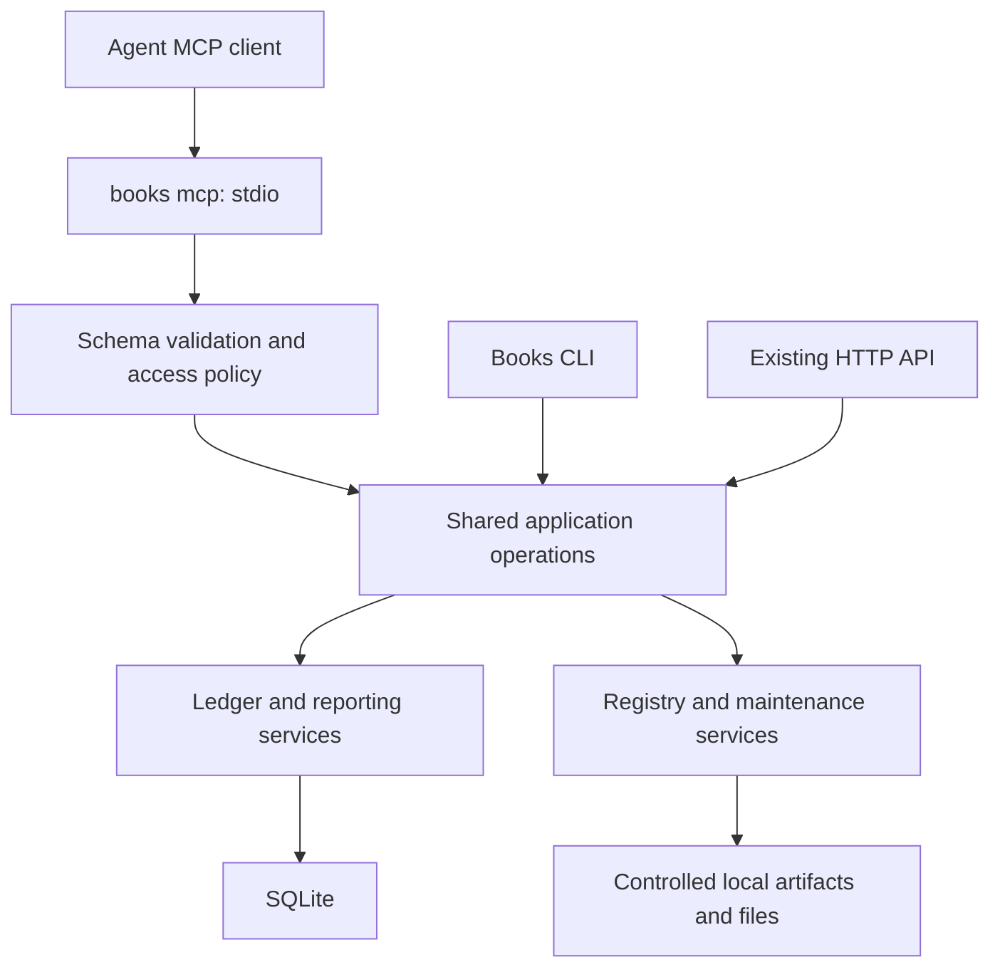

# Built-in Books MCP server

Implementation update: existing operation coverage is implemented; see
[validation and scope](implementation/parity-progress.md) and [current usage](mcp.md).
The historical proposal below includes broader ideas not adopted for this focused
parity implementation: owner-profile shortcuts, arbitrary roots, universal receipts,
and client setup helpers. Its proposed tool names and policy are not launch instructions.

Status: target design, September 13, 2026. Commands, policy
fields, and schemas below describe the complete intended interface; use the current usage guide for implemented behavior. Baseline:
`2c492eef297d778e064531eaa4448b5494890999`.

## Decision

This design follows the [complete backend and interface parity contract](interface-parity.md).
The CLI, HTTP API and MCP are thin frontends over the same complete operation
catalog. No accounting or administrative feature is reserved for one frontend.

Add `books mcp` to the existing binary. It serves typed MCP tools over stdin and
stdout, using the same application and ledger services as the CLI. It opens no
network listener and requires no separately running Books HTTP API. The HTTP API must expose the same
complete operations with explicit authorization. An agent
can perform every supported accounting and administrative operation when launched
with the corresponding access policy, including company creation, imports,
consolidation, migrations, backup and restore.

Use explicit, task-named tools, not a shell command runner, arbitrary SQL tool,
or generic `execute(action, arguments)` escape hatch. Retain low-level workflows
alongside convenient bookkeeping operations. The [coverage map](mcp-coverage.md)
accounts for the current CLI and additional HTTP capabilities; full coverage is
an acceptance requirement, not a claim about an early subset.

## First use

The primary user experience is: install Books, register its local MCP process in
an agent client, then ask that agent to set up and operate the books. An example
launch contract is:

```text
books mcp --policy /absolute/path/books-mcp.json
```

`--policy` is required. It is a private, operator-owned file; no permissions are
inferred from the client's claimed identity or from tool arguments. A setup helper
should generate this file and print generic command/args connection settings
without editing a client's configuration automatically. The README should show
an isolated demo first, then the owner configuration for the user's actual Books
home. Client-specific instructions ship only after testing those clients.

A proposed full-owner policy, suitable for a deliberately selected Books home:

```json
{
  "schema": "books.mcp-policy/v1",
  "actor": "personal-agent",
  "config_path": "/absolute/path/books-home/books.toml",
  "profile": "owner",
  "company_scope": "all_registered",
  "database_roots": ["/absolute/path/books-home"],
  "read_roots": ["/absolute/path/statement-inbox"],
  "write_roots": ["/absolute/path/books-exports"],
  "state_directory": "/absolute/path/books-mcp-state"
}
```

Owner grants all Books operations within these configured boundaries, including
new company creation. `all_registered` explicitly includes future registrations;
restricted policies instead enumerate companies and database identities. Refuse
unknown fields, ambiguous roots, non-private files, and incompatible policies.
Do not silently fall back to owner access. Policy changes require process restart;
ordinary company data changes do not.

The installed binary and policy path are outside tool-writable roots. An agent
must not be able to use a file export or config tool to rewrite its own grants.
Host/client permission controls still apply. A process launched by an owner has
that OS user's authority; this is application-level restriction, not a sandbox
against another process already running as that user.

## Architecture and implementation boundaries



Introduce `internal/mcpserver` for protocol registration, typed transport DTOs,
result rendering, and resource resolution. Introduce shared authorization and
operation descriptors below the transports. Extend `internal/application` for
currently CLI-only operations; reuse `internal/ledger`, `internal/report`, and
`internal/store/sqlite` rather than moving accounting rules into MCP handlers.
Do not invoke Cobra handlers, subprocesses, or HTTP loopback requests from tools.

Existing company-bound `application.Service` deliberately cannot select arbitrary
books or paths. Preserve that property. Add a distinct database-administration
service for entity/group/ownership changes, elimination books, schema operations,
and raw database maintenance. Give it a verified database handle from policy,
not an unrestricted filename supplied by a caller. Low-level entity/book inputs
must be bound to the authorized database and, where applicable, every affected
company. Do not loosen the company service to achieve feature parity.

The operation catalog is backend-owned, not MCP-owned. It owns canonical IDs, typed input/output definitions, scope,
required grants, mutation effects, retry behavior, and CLI/API mappings. MCP tool
registration, HTTP/OpenAPI bindings, CLI mappings, documentation and coverage tests
derive from this catalog. Parsing,
validation and accounting semantics remain in shared services; transport-specific
money encoding remains in adapters. Preserve existing CLI/API compatibility.

## Tool discovery and ergonomics

Expose one stable tool for each distinct operation. Use descriptive names such
as `books_spend`, `books_bank_import_preview`, `books_reconcile_apply`, and
`books_report_profit_loss`. Similar aliases map to a single tool only where
explicit fields preserve their semantics. In particular, low-level draft journal
reversal and the convenient posted reversal remain distinct operations.

The complete catalog will be large: the baseline has 113 inventoried CLI command
paths including aliases and the runnable `periods` parent. Do not hide missing
functionality behind a generic command tool to make the count look smaller.
Provide deterministic paginated `tools/list`, concise descriptions and small
schemas. Restricted launch profiles reduce the exposed set by permission.
An optional static domain filter may reduce a client's catalog, but the owner
profile without a domain filter exposes the complete surface. No conversational
“enable more tools” step or connection-dependent tool-list mutation is required.

`books_capabilities` returns build and contract versions, supported currencies
and formats, active profile, allowed scopes, limits, and tool categories. It
never returns credentials or unauthorized company names. Each tool description
states when to use it, necessary inputs, whether it writes/posts, its retry
contract, and its expected result. Do not dump the full manual into tool schemas.

Tool annotations reflect actual behavior. A plan saved to disk or SQLite is not
read-only. `idempotentHint` is true only with an enforced replay contract;
`destructiveHint` is true for restore, migration and destructive administrative
changes even if they have backups. Annotations inform clients; service-level
authorization enforces access.

## Access model

Keep the existing read/import/post/manage distinctions and add explicit registry,
database-administration and file-transfer privileges. A grant is not implied by
possession of an object ID. Every tool call, resource read, plan lookup, chunk,
and retry checks authorization and target identity.

| Profile | Authority |
| --- | --- |
| reader | Read allowed company reports, records and source evidence |
| bookkeeper | Reader plus imports and ordinary posting/corrections in allowed companies |
| manager | Bookkeeper plus chart/default changes, reopen and period/year close |
| owner | All above plus registry, selected database administration, backup/restore and configured file roots |

Profiles expand to explicit grants; restricted custom grants are supported.
Low-level operations without an established company-safe authorization boundary
require database-administration authority initially; the owner profile retains
full functionality. Any later narrower grant needs explicit scope tests.
Preserve manage-plus-post checks on year-close journals and their corrections.
Do not let low-level `journal_post` or `period_year_close` bypass the equivalent
high-level permission checks. Configuration output preferences may be changed by
an owner for CLI parity but never alter MCP's protocol output.

Require an explicit company on company tools. Do not use the mutable registry
default as implicit MCP conversation state. Database-wide exports, Doctor/audit,
backup and restore require authority over the whole database, because a shared
database may contain other companies. Consolidation reports require every member
and elimination scope; never return a silently partial consolidated statement.
Unauthorized and nonexistent IDs should have the same public error behavior.

## Schemas, results and errors

Use strict JSON Schema inputs and outputs, with unknown fields rejected. Preserve
all supported operation inputs: explicit dates and ranges, source identities,
book/period selection, metadata, split lines, reconciliation allocations, import
options, drafts and existing dry-run modes. Validate domain limits after schema
validation. MCP numbers must not truncate money or 64-bit identifiers.

- Money is a decimal **string** in the entity's currency, as in the CLI, converted
  by the existing currency-aware parser. Never accept binary floating-point money.
- Int64 counters and identifiers are strings where precision could exceed JSON's
  interoperable integer range. Bounded page sizes remain integers.
- Dates are ISO calendar strings. Require explicit posting/report dates in tool
  schemas; workflow prompts can help agents derive them from the user's intent.
- Company keys, database handles, journal IDs, transaction numbers, job IDs and
  plan IDs are distinct fields. Reject mixed or inconsistent selectors.

Example `books_spend` arguments (proposed):

```json
{
  "company": "example-studio",
  "amount": "50.00",
  "expense_account": "Software",
  "payment_account": "Checking",
  "date": "2026-09-11",
  "description": "Synthetic software expense",
  "idempotency_key": "demo-software-2026-09-11",
  "mode": "post"
}
```

`mode` is explicitly required: `preview`, `draft`, or `post`. It does not change
CLI defaults. Where an operation has different valid modes, its schema lists
only those modes. A preview validates without mutation; saving a plan is a
separate, accurately described write where the underlying workflow requires it.

Successful calls return structured content conforming to `books.mcp/v1`, plus a
short human-readable summary. Include resolved scope, operation ID, actual
status (`previewed`, `draft`, `posted`, `applied`, or `replayed`), data, warnings,
and evidence references. Financial reports include currency, basis and coverage.
Large results return a page and an artifact handle rather than truncating data.
The envelope is a Books contract; the SDK provides the negotiated MCP wrapper.

Domain/authorization/stale-plan errors are tool results with `isError: true` and
stable Books codes, safe details, and a specific recovery action. Unknown methods
or tools and malformed protocol requests use the protocol error path. Never
report a successful write merely because an operation was accepted or a plan
file exists. Sanitization removes secret values and unauthorized filesystem paths.

## Posting, plans and replay

All mutating tools require a caller-generated idempotency key. Bind it to actor,
operation kind, canonical target identity and canonical input digest. Reuse with
different input is a conflict. For ledger writes, record the operation receipt
and effect in the same SQLite transaction. Extend shared services where the
current operation lacks atomic receipt support; an in-memory MCP cache is not
sufficient. Preserve existing import identity/replay semantics underneath this.

`books_operation_status` resolves a key after a timeout or restart. A completed
retry returns the stored result without another effect. A disconnected client
must not assume cancellation rolled back a committed transaction. Honor the
negotiated protocol's cancellation rules; finish or roll back atomic work and
make the outcome queryable afterward. Apply one bounded writer queue per database
inside the process and preserve SQLite/interprocess locking against other clients.

Use current plan/digest semantics for imports, reconciliation and close. Persist
plans with scope and lineage, return a plan ID and digest, and require both at
apply time. The server resolves the original plan; caller-edited JSON is not the
reviewed artifact. Recheck grants, source hashes, ledger state and lineage under
the write lock. Expose both plan and apply tools rather than a model-supplied
`approved: true` pretending to establish human approval. The host owns user
confirmation and standing authorization; full access does not require repeated
permission questions for every routine entry.

For restore and migration, add a preview returning an exact target, source hash
where applicable, current and intended schema/lineage, effects, and a bound plan.
Applying restore also requires the exact target confirmation supported today.
These operations acquire an exclusive maintenance lock, drain affected handles,
run the existing verified backup/restore or migration mechanism, then reopen and
verify identity. Persist a protected maintenance journal outside the database
being replaced; reconcile it with database state after a crash. Never replay an
ambiguous filesystem swap automatically. This is required new implementation,
not a guarantee already provided by today's transport.

## Files, imports and resources

Agents must be able to import every supported format and obtain complete exports
without unrestricted filesystem access. Support both an explicitly authorized
local path and staged content:

- Resolve local paths beneath policy read/write roots using descriptor-relative,
  traversal-resistant operations. Reject symlinks, special files, path escapes
  and races; avoid string-prefix checks or check-then-open authorization.
- Stage inline bytes or bounded chunks into private storage. Bind handles to
  actor and scope; verify total size, ordered offsets, content digest and final
  length before use. Unfinished uploads expire with bounded disk usage. Keep
  existing parser size/count/decompression limits authoritative.
- For QuickBooks directories, stage a manifest of named files. Reject absolute
  and parent-relative names. Retained lifecycle evidence needs the complete
  supported evidence bundle, not just a statement attachment.
- Never fetch arbitrary URLs or accept `file://` resource URLs as authorization.
  An import's descriptions, filenames and contents are untrusted data, never
  agent instructions. Render them as labeled data without promoting their text
  into tool descriptions or workflow prompts.

Expose resources for embedded public docs, currency/format definitions, company
summaries, plans, report artifacts and authorized evidence. Use opaque
`books://` URIs; no filesystem paths are exposed as universal capabilities.
Resolve authorization on every read. Provide equivalent `books_plan_get` and
`books_artifact_read` tools so clients that do not expose resources can still do
all work. Large artifacts support bounded offset reads and explicit export into
write roots. Whole-database backup downloads retain database-wide permissions.

Initially use no resource subscriptions. Offer static prompts for isolated demo,
statement review, reconciliation and report preparation; prompts are conveniences,
not required steps or sources of authority. MCP roots and model sampling are not
needed for any Books operation.

## Protocol, dependency and resource limits

Use the official [Go SDK](https://github.com/modelcontextprotocol/go-sdk), pinned
to a reviewed stable release during implementation. Its current compatibility
table identifies v1.7.0+ with the 2026-07-28 protocol and older versions. Review
its license and transitive dependencies before adding it; no dependency is added
by this design. Let the SDK handle protocol-version behavior instead of writing
our own JSON-RPC framing or lifecycle. Test both current discovery and older
initialization clients that the chosen SDK supports.

The [stdio specification](https://modelcontextprotocol.io/specification/2026-07-28/basic/transports/stdio)
uses standard streams and requires protocol-only stdout. Send redacted diagnostic
messages to stderr; Cobra banners, progress text and table output must never enter
stdout. Exit cleanly on input EOF. The [tool specification](https://modelcontextprotocol.io/specification/2026-07-28/server/tools)
provides schemas, structured results, annotations and paginated discovery. Keep
catalogs deterministic and authorization-based, not altered by previous calls.
The [resource specification](https://modelcontextprotocol.io/specification/2026-07-28/server/resources)
provides the URI-based companion access mechanism. Protocol sources were checked
September 13, 2026; recheck SDK compatibility before implementation.

Proposed configurable defaults: 1 MiB incoming protocol message, 256 KiB inline
file chunks and result pages, 100 rows per page (maximum 500), four concurrent
reads and one active writer per database, and 256 MiB aggregate staged files per
process. Enforce byte limits before decoding, then nesting/field/count limits.
Larger files use chunks; parser-specific maxima still apply. Backup/export files
may exceed staging limits through bounded streamed file operations. Quotas fail
explicitly; they do not drop records. Provide deterministic cursor pagination and
snapshot identity for reports so changing ledgers cannot mix pages silently.

Use a 30-second default read deadline and configurable longer maintenance/import
deadlines with progress. A durable import job may be queried after a call ends;
this application job handle does not require experimental MCP task features.
Keep operation receipts as long as their accounting replay guarantees require;
artifact eviction must not erase evidence or idempotency records. Define and test
crash recovery before enabling automatic cleanup of abandoned operations.

No Streamable HTTP MCP transport in the first implementation. This does not limit
the existing HTTP/JSON API: its complete administrative and accounting coverage
is required by the parity contract. Complete Books
functionality remains available through stdio. A future network transport needs
its own reviewed authorization, origin, session, TLS and deployment design; the
existing API's bearer policy must not be assumed to satisfy every MCP client.
`books serve` remains an explicit operator-launched API process. Do not expose a
tool that silently starts listeners, changes grants, or installs software.

## Delivery and acceptance

1. Implement the shared operation catalog and complete capability/argument map
   for CLI, HTTP/JSON and MCP.
   Add missing company/database administration adapters without changing public
   CLI/API behavior. Decide persistence changes for receipts and maintenance
   journals before migrations; this document does not execute or approve one.
2. Add SDK integration, stdio, strict policy, scope checks, tools, bounded artifacts
   and schemas. Ship company setup and demo as the first internal milestone.
3. Complete HTTP API and MCP bindings for all operations in the coverage map, including low-level journals,
   evidence/lifecycle, consolidation, registry, backup/restore and migration.
   Early milestones must advertise their actual subset, not full parity.
4. Test every canonical operation across CLI, HTTP API and MCP using
   identical invented inputs and comparison of accounting results and effects.
   Test draft versus posted reversal, all dry-run modes, import formats, retained
   evidence bundles, shared-database isolation, and database-wide permissions.
5. Exercise exact money and int64 boundaries, stale plans, conflicting/repeated
   keys, concurrent clients, interruption before/after commit, maintenance crashes,
   path/symlink races, malformed frames, injection payloads, and aggregate quotas.
   Run real stdio client discovery/tool/resource calls on macOS and Linux and
   verify no listening sockets. stdout must contain only protocol messages.
6. Obtain independent security and code review, run `./scripts/check`, and test
   the published quickstart in fresh sessions of each advertised agent client.
   Verify setup, company creation, statement import/reconciliation, reports,
   correction, close/reopen, backup and restore end to end. Record source/SDK/client
   versions and actual user interventions. Update README, security policy and
   operational docs only with capabilities that pass these gates.

The design is complete enough to implement in stages. No unresolved choice is
needed to select transport, coverage, tool shape, access boundaries or money
encoding. Dependency pinning, persistence schema details and client compatibility
are implementation gates, with full parity and independent review required before
claiming a finished agent interface.
